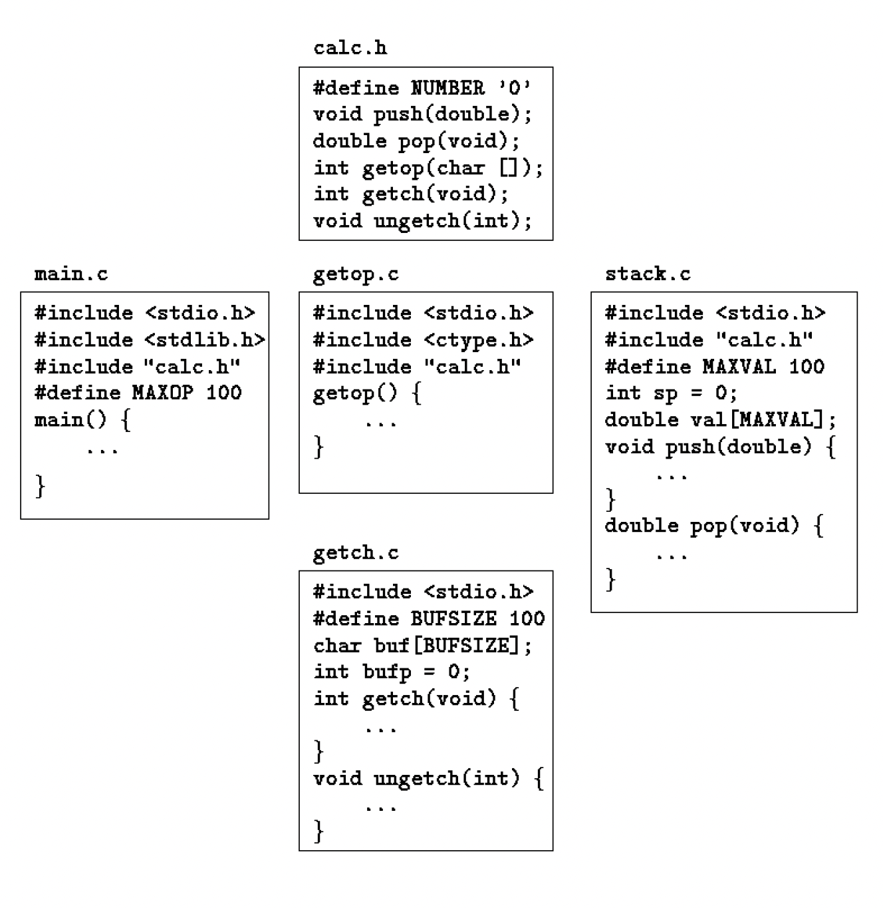

## Header Files

If we consider dividing the calculator program into several source files, as it might be is each of the components were substantially bigger. The `main`function would go in one file `main.`; `push`[...]
There is one thing to worry about - the definitions and declarations shared among files. As much as possible we want to centralize this, so that there is only one copy to get and keep right as the [...]
The resulting program looks like this:

